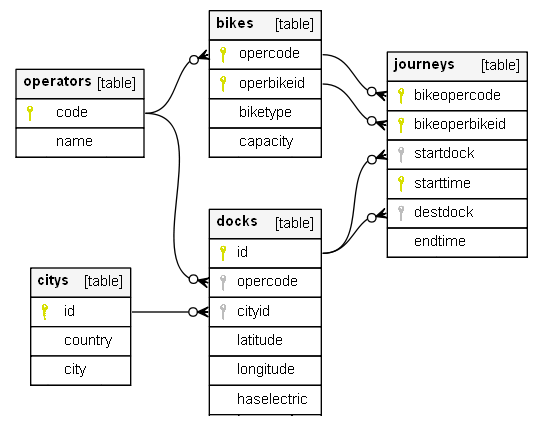
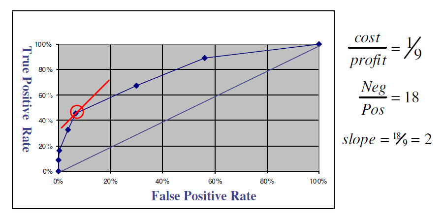

# DAT Assignment - 2019 - Kamal Mahmassani

_An online version of this document can be found at https://github.com/kmahmassani/DAT-Assignment/blob/master/Assignment/Assignment.md_

## Question 1:

### A)



```sql
--Operators table contains all the operator codes, along with their names.  Names are unique for each operator
CREATE TABLE Operators (
	Code INT PRIMARY KEY,
	Name VARCHAR(100) NOT NULL UNIQUE
);

-- BikeType allows us to constrain the type of bikes allowed to either Manual or Electric
CREATE TYPE BikeType AS ENUM (
	'Manual',
	'Electric'
);

-- The Bikes table references the Operators table for Operator Codes, primary key is a combination of OperCode
-- and OperBikeID, Capacity may be null to allow for manual bikes
CREATE TABLE Bikes (
	OperCode INT NOT NULL REFERENCES Operators(Code),
	OperBikeID VARCHAR(100) NOT NULL,
	BikeType BikeType NOT NULL,
	Capacity INT,
	PRIMARY KEY (OperCode, OperBikeID)
);

CREATE TABLE Citys (
	ID INT GENERATED ALWAYS AS IDENTITY,
	Country VARCHAR(100) NOT NULL,
	City VARCHAR(100) NOT NULL,
	PRIMARY KEY (ID),
	UNIQUE (Country, City)
);

CREATE TABLE DOCKS (
	ID VARCHAR(100) PRIMARY KEY,
	OperCode INT NOT NULL REFERENCES Operators(Code),
	CityID INT NOT NULL REFERENCES Citys(ID),
	Latitude DOUBLE PRECISION NOT NULL,
	Longitude DOUBLE PRECISION NOT NULL,
	HasElectric BOOL NOT NULL
);

-- Journeys references Docks table twice, once for start dock and another time for end dock
-- Primary key is chosen because logically the same bike can only start one trip at a time
CREATE TABLE Journeys (
	BikeOperCode INT NOT NULL,
	BikeOperBikeID VARCHAR(100) NOT NULL,
	StartDock VARCHAR(100) NOT NULL REFERENCES Docks(ID),
	StartTime TIMESTAMP NOT NULL,
	DestDock VARCHAR(100) REFERENCES Docks(ID),
	EndTime TIMESTAMP,
	-- Assumed that we would want to allow nulls for destination dock and end time,
	-- so that we can have info for journeys that have started but not finished yet
	PRIMARY KEY (BikeOperCode, BikeOperBikeID, StartTime),
	FOREIGN KEY (BikeOperCode, BikeOperBikeID) REFERENCES Bikes (OperCode, OperBikeID)
);
```

<br/>
<br/>
<br/>
<br/>
<br/>
<br/>
<br/>

### B)

> A relation, R, is in BCNF iff for every nontrivial FD (X->A) satisfied by R the following condition is true:
> (a) X is a superkey for R

- #### Operators

  | Code | Name          |
  | ---- | ------------- |
  | 1    | Santandar     |
  | 2    | Oxford Bikes  |
  | 3    | London Cycles |

  #### Super/Candidate Keys:

  - { Code }
  - { Name }

  ##### Non-Trivial FDs:

  - { Code } → { Name }
  - { Name } → { Code }

  #### ✓ BCNF because each FD originates from a Super/Candidate Key

* ### Bikes

  | OperCode | OperBikeId | BikeType | Capacity |
  | -------- | ---------- | -------- | -------- |
  | 1        | AB-1       | Manual   | NULL     |
  | 1        | AB-2       | Manual   | NULL     |
  | 1        | AB-3       | Electric | 100      |
  | 2        | AB-1       | Manual   | NULL     |
  | 2        | CD-1       | Electric | 95       |
  | 2        | CD-3       | Electric | 100      |

  #### Super/Candidate Keys:

  - { Opercode, OperBikeId }

  #### Non-Trivial FDs:

  - { Opercode, OperBikeId } → { BikeType,Capacity }

  #### ✓ BCNF because each FD originates from a Super/Candidate Key

* ### Journeys

  | BikeOperCode | BikeOperBikeId | StartDock | StartTime        | DestDock | EndTime          |
  | ------------ | -------------- | --------- | ---------------- | -------- | ---------------- |
  | 1            | AB-1           | Dock-1    | 2020-01-01 09:00 | Dock-2   | 2020-01-01 09:30 |
  | 1            | AB-2           | Dock-1    | 2020-01-01 09:00 | Dock-2   | 2020-01-01 09:30 |
  | 2            | AB-1           | Dock-3    | 2020-01-01 09:00 | Dock-2   | 2020-01-01 09:30 |
  | 1            | AB-1           | Dock-2    | 2020-01-02 09:00 | Dock-4   | 2020-01-02 10:30 |

  #### Super/Candidate Keys:

  - { BikeOperCode, BikeOperBikeId, StartTime }
  - { BikeOperCode, BikeOperBikeId, EndTime }

  #### Non-Trivial FDs:

  - { BikeOperCode, BikeOperBikeId, StartTime } → { StartDock, DestDock, EndTime }
  - { BikeOperCode, BikeOperBikeId, EndTime } → { StartDock, StartTime, DestDock }

  #### ✓ BCNF because each FD originates from a Super/Candidate Key

* ### Docks

  | Id     | OperCode | CityId | Latitude  | Longitude | HasElectric |
  | ------ | -------- | ------ | --------- | --------- | ----------- |
  | Dock-1 | 1        | 22     | 51.507664 | -0.127777 | No          |
  | Dock-2 | 1        | 22     | 51.512018 | -0.131817 | No          |
  | Dock-3 | 2        | 23     | 51.755545 | -1.260049 | No          |
  | Dock-4 | 3        | 23     | 51.755545 | -1.260296 | Yes         |
  | Dock-5 | 2        | 23     | 51.895545 | -1.260296 | Yes         |

  #### Super/Candidate Keys:

  - { Id }
  - { CityId, Latitude, Longitude }

  #### Non-Trivial FDs:

  - { Id } → { OperCode, CityId, Latitude, Longitude, HasElectric }
  - { CityId, Latitude, Longitude } → { Id, OperCode, CityId, HasElectric }

  #### ✓ BCNF because each FD originates from a Super/Candidate Key

* ### Citys

  | Id  | Country | City     |
  | --- | ------- | -------- |
  | 22  | UK      | London   |
  | 23  | UK      | Oxford   |
  | 24  | USA     | London   |
  | 24  | USA     | New York |

  #### Super/Candidate Keys:

  - { Id }
  - { Country, City }

  #### Non-Trivial FDs:

  - { Id } → { Country, City }
  - { Country, City } → { Id }

  #### ✓ BCNF because each FD originates from a Super/Candidate Key

### C)

#### C1: All docks with lat > 90

`{ (id) | ∃o,co,ci,latitude,l,h Docks(id,o,co,ci,latitude,l,h) ∧ latitude > 90 }`

```sql
--Make sure latitude is not larger than 90
ALTER TABLE Docks ADD CONSTRAINT LAT_CHECK CHECK (latitude <= 90);
```

#### C2: All Journeys with start time after end time

`{ (bO,bId,sD,startTime,dD,endTime) | Journeys(bO,bId,sD,startTime,dD,endTime) ∧ startTime > endTime }`

```sql
--Make sure start time is not after end time
ALTER TABLE Journeys ADD CONSTRAINT START_CHECK CHECK (starttime <= endtime);
```

#### C3: Manual Bikes with Capacity

`{ (oC, oB, "Manual", cap) | Bikes(oC, oB, "Manual", cap) ∧ cap > 0 }`

```sql
--Make sure that manual bikes have no capacity
ALTER TABLE Bikes ADD CONSTRAINT CAP_CHECK CHECK (NOT (biketype = 'Manual' AND (capacity is not NULL OR capacity > 0)))
```

#### C4: All electric bikes that end journeys at non-electric docks

`{ (oCode, oBike, "Electric", c) | Bikes(oCode, oBike, "Electric", c) ∧ Journeys(oCode, oBike, sd, st, destDoc, et) ∧ Docks(destDoc, oc, c1, c2, l, l1, false)}`

We cannot create an SQL Constraint statement to stop electric bikes from docking at non-electric docks, because a constraint condition can only refer to columns in the current row, and the required journey and dock info are in other tables.

## Question 2:

### A) All bikes with Operator "Santander Cycles London"

π<sub>OperCode,OperBikeID,BikeType,Capacity</sub>(Bikes ⋈ π<sub>OperCode</sub>(σ<sub>name~'Santander Cycles London'</sub>(Operators)))

### B) All bikes with Journeys ending at "UK-Oxford-536" or "UK-Oxford-435"

`{ (oCode, oBike, t, c) | Bikes(oCode, oBike, t, c) ∧ (Journeys(oCode, oBike, sd, st, "UK-Oxford-536", et) ∨ Journeys(oCode, oBike, sd1, st1, "UK-Oxford-435", et1)) ) }`

### C) All bikes which have never travelled to "UK-London-116"

`{ (oCode, oBike, t, c) | Bikes(oCode, oBike, t, c) ∧ ¬Journeys(oCode, oBike, sd, st, "UK-London-116", et) }`

### D) All bikes which started at the same dock on 2 consecutive days

`{ (oCode, oBike, t, c) | Bikes(oCode, oBike, t, c) ∧ Journeys(oCode, oBike, sd, st, ed, et) ∧ Journeys(oCode, oBike, sd, st + 1, ed1, et1)}`

### E) All docks where at least two bikes started from

`{ (dockId, oCode, c, la, lo, ele) | Docks(dockId, oCode, c, la, lo, ele) ∧ Journeys(oCode1, oBike1, dockId, st, ed, et) ∧ Journeys(oCode2, oBike2, dockId, st2, ed2, et2) ∧ ((oCode1 ≠ oCode2) ∨ (oBike1 ≠ oBike2)) }`

### F) Top 10 busiest docks

We cannot express this relation as there is no operator to count (or other aggregate functions) the number of journeys ending at each dock.

### G) Docks reached from "UK-London-231" by Santandar bike "4928302"

We cannot express this relation as there is no upper bound to the number of journeys. If there was an upper bound such as _n_, we could just join up to _n_ times on the Journeys relation.

## Question 3:

### A) All bikes with Operator "Santander Cycles London"

```sql
SELECT *
FROM BIKES b
INNER JOIN OPERATORS o on b.opercode = o.code
WHERE o.name = 'Santander Cycles London'
```

### B) All bikes with Journeys ending at "UK-Oxford-536" or "UK-Oxford-435"

```sql
SELECT *
FROM BIKES b
INNER JOIN Journeys j on b.opercode = j.bikeopercode AND b.operbikeid = j.bikeoperbikeid
INNER JOIN Docks d on j.destdock = d.id
WHERE d.id in ('UK-Oxford-536','UK-Oxford-435')
```

### C) All bikes which have never travelled to "UK-London-116"

```sql
SELECT *
FROM BIKES b
WHERE NOT EXISTS
               (SELECT 1
                FROM Journeys j
                INNER JOIN Docks d on j.destdock = d.id
                WHERE b.opercode = j.bikeopercode AND b.operbikeid = j.bikeoperbikeid
                AND d.id = 'UK-London-116')
```

### D) All bikes which started at the same dock on 2 consecutive days

```sql
SELECT *
FROM BIKES b
INNER JOIN Journeys j on b.opercode = j.bikeopercode AND b.operbikeid = j.bikeoperbikeid
INNER JOIN Docks d on j.destdock = d.id
WHERE EXISTS (SELECT 1
		  FROM Journeys j2
		  WHERE j2.bikeopercode = j.bikeopercode AND j2.bikeoperbikeid = j.bikeoperbikeid
		  AND j2.startdock = j.startdock
		  AND j2.starttime::date = j.starttime::date + INTERVAL '1 day')
```

### E) All docks where at least two bikes started from

```sql
WITH CTE AS (SELECT DISTINCT bikeopercode, bikeoperbikeid, startdock FROM Journeys) -- get all the bikes that have ever used the dock, removing duplicate rows
SELECT startdock AS dockid, COUNT(*)
FROM CTE
GROUP BY startdock
HAVING COUNT(*) > 1
--for simplicity, I have left out retrieving the rest of the Dock data, but this can be gotten via a simple inner join between cte and the docks table in the final query
```

### F) Top 10 busiest docks

```sql
SELECT d.*, COUNT(*)
FROM Journeys j
INNER JOIN Docks d on destdock = d.id
GROUP BY destdock
ORDER BY COUNT(*) DESC
LIMIT 10
```

### G) Docks reached by Santander bike "4928302" from dock "UK-London-231"

```sql
WITH RECURSIVE paths(destdock, endtime) AS (
	SELECT destdock, endtime
	FROM Journeys
	INNER JOIN Operators o ON Journeys.bikeopercode = o.code
	WHERE Journeys.startdock = 'UK-London-231' AND o.name = 'Santander Cycles London' AND Journeys.bikeoperbikeid = '4928302'
UNION ALL
	SELECT j.destdock, j.endtime
	FROM paths p, Journeys j
	WHERE j.startdock = p.destdock
	AND j.starttime > p.endtime -- to make sure we dont go back in time
)

SELECT destdock
FROM paths
--for simplicity, I have left out retrieving the rest of the Dock data, but this can be gotten via a simple inner join between paths and the docks table in the final query
```
<br/>
<br/>
<br/>

<div style="text-align: justify">

## Question 4:

We will approach the task with 4 phases:

### 1. Business understanding

The goal of the datamining task will be to identify gaps in bike availability. The two least desirable states for a dock are completely full or completely empty, i.e. nowhere to park or no bikes to use. If a model can be found to accurately predict these two states, bikes may be moved from full docks to empty ones to rebalance between places to park and bikes that can be taken.

### 2. Data understanding

We have:

- Dock locations and capacities (we are assuming that all docks have the same capacity, or that capacity is added to the docks table)
- Journeys data to and from docks, along with start and end dates and times
- Bike types used (Manual/Electric)

We can obtain and enrich our data with:

- Location zone data (industrial/commercial/residential areas)
- Historical Weather data
- Initial bike distribution

### 3. Data Selection and Preparation

#### We suspect that we need:

- Initial bike distribution and Journeys to calculate each dock's availability
- The time of day because of daily commutes effect on usage
- The location zone also because of return trip daily commutes (residential → commercial and vice versa)
- The date and weather, because people may enjoy riding in moderate weather, yet choose the tube for very cold or very hot weather

#### We clean the data by:

- Removing weather data from before the ShareBike system was operational
- Any journey data without and end (bike probably stolen)
- Any journey data with a bike starting or ending at an incompatible dock
- Zones without docks

#### We construct data by:

- Removing year from date (doesn't repeat so not of use), and splitting out into Month, Day, Time of Day fields.
- Categorizing weather conditions and temperature into a few clusters such as (Wet, Sunny, Cloudy) along with (Freezing, Cold, Warm, Hot)

#### We merge and integrate data by:

- Writing a query that sums Initial bike distribution and groups journeys by docks and date+time, creating the number of bikes available at each dock at any given time.
- We then join on the weather conditions and temperature at each given time.
- We then join on the location info.

This should give us one wide table that contains the number of bikes at each dock at any given moment in time, along with the corresponding weather conditions and dock zone.

#### We model by:

- Choosing predictive modelling, as we would like to predict dock's bike availability in the future.
- We must split the data into a learning set and a test set. We must be careful about how we do this split, as we only have one year of data, i.e. we don't have repeating seasons. So, we might try to split it to get a good mix of weather conditions, days of the week, and location info in each set. We must also choose a split percentage, e.g. 70% learning and 30% test.
- The learning set will have the dock's bike availability included, while the test set will have this value excluded.
- We run the data through the tool of our choice (e.g. weka) along with the model setting of our choice (continuous/regression)

#### We evaluate our models by:

- Performing and ROC analysis. Which model has greater test-set accuracy? Is a false-positive more costly than a true-negative (Is it worse to have no parking spaces or no bikes available for use?). We then plot these models on a graph against the ratio of true-positive vs false-positive rate and compare their respective cost to profit ratios.
  

### We then deploy our plan by:

- "Rebalancing" bikes (moving them from a full to empty dock) according to predictions by our model.
- Evaluating if this then results in less docks in full/empty states.
- Adjusting the model for greater accuracy as needed as more data becomes available over time.

</div>
